<!-- TOP INTERACTIVE SVG WIDGETS -->

  

<table align="center" border="0">
  <tr>
    <td valign="top" align="center"></td>
    <td valign="top" align="center"></td>
  </tr>
</table>

 

<!-- HERO SECTION -->

  <!-- Dynamic Animated Header Banner -->
  

  <!-- Dynamic Typing SVG Animation -->
  

  
<i>Building scalable backend systems, responsive modern web applications, and resilient digital architectures.</i>

  <!-- Social Badges with Custom Gold & Dark Theme -->
  

    
    
    
    
  

  <!-- Visitor Counter -->
  

 

<!-- ================= ABOUT ME ================= -->
<h2 align="center">🚀 About Me</h2>

<table width="100%" border="0">
  <tr>
    <td width="55%" valign="top" style="border: none; background: none;">

### 👨‍💻 Who Am I?

* 🎓 **MCA Scholar (2024–2026)** • COER University, Roorkee
* 🎓 **BCA Graduate** • COER University, Roorkee
* 💼 **Full Stack Developer** at **Bissbay Solutions** (April 2024 – Present)
* 🏢 Ex-**Web Developer** at **College Duniya** (2023 – 2024)
* 💻 **Primary Expertise:** Robust PHP (OOP/MVC), optimized MySQL database schema & indexing, modern React.js frontend development, and custom WordPress CMS architecture.
* 🚀 Passionate about engineering production-ready SaaS/ERP systems, secure authentication pipelines, and high-conversion web experiences.
* 🌱 Currently mastering **Advanced Microservices, System Architecture, Redis High-Throughput Caching, and WebGL / Three.js 3D Web UI.**

<blockquote>
  

    <i>"Clean code isn't just about syntax — it's about building scalable, secure, and resilient systems that solve real-world problems."</i>
  

</blockquote>

  </td>

  <td width="45%" align="center" valign="middle" style="border: none; background: none;">
    <!-- Interactive Terminal Typing Coding Animation -->
    
  </td>
</tr>
</table>

<!-- Skill Icons Strip -->

  

<!-- Detailed Stack Breakdown -->
<table width="100%" align="center">
  <tr>
    <td width="50%" valign="top">
      <h3>💻 Programming & Languages</h3>
      

        
        
        
        
        
         OOP Principles • ES6+ • Data Structures • Algorithms • Procedural & Object-Oriented Design
      

       

      <h3>🎨 Frontend Development</h3>
      

        
        
        
        
         Single Page Applications (SPA) • Hooks & Context API • Redux • Framer Motion • WebGL Shaders • Responsive UI/UX
      

       

      <h3>🗄️ Databases & Data Storage</h3>
      

        
        
        
        
         Relational Database Schema Design • Query Optimization • Indexing Strategies • ACID Transactions • phpMyAdmin
      

    </td>

    <td width="50%" valign="top">
      <h3>⚙️ Backend Architecture & CMS</h3>
      

        
        
        
        
         Custom WordPress Themes & Plugins • RESTful APIs • JSON Web Tokens (JWT) • Session & Cookie Management • WooCommerce
      

       

      <h3>🔐 Security & Best Practices</h3>
      

        
        
         SQL Injection Prevention • XSS & CSRF Defense • Prepared Statements • Role-Based Access Control (RBAC) • Secure Auth
      

       

      <h3>🛠️ DevOps, Cloud & Tools</h3>
      

        
        
        
        
        
         Linux CLI • cPanel Management • VPS Hosting • Git Workflow • API Testing
      

    </td>
  </tr>
</table>

 

<!-- ================= FEATURED PROJECTS ================= -->

  

<table width="100%">
  <tr>
    <td width="50%" valign="top">
      <h3>🏢 <a href="https://github.com/devwithanasraza/karobar-bazar">Karobar Bazar — Business ERP & Invoicing</a></h3>
      
A full-fledged commercial enterprise resource planning (ERP) platform developed for businesses to handle invoicing, inventory control, and ledger accounting.

      

        <code>PHP 8</code> <code>MySQL</code> <code>JavaScript</code> <code>Bootstrap 5</code> <code>REST API</code>
      

      <ul>
        <li>✔ Real-time automated tax calculation, GST compliance & invoice generation</li>
        <li>✔ Multi-tenant role-based access control (Admin, Accountant, Store Manager)</li>
        <li>✔ Comprehensive financial summaries, ledger balance & sales forecasting charts</li>
      </ul>
    </td>
    <td width="50%" valign="top">
      <h3>💰 <a href="https://github.com/devwithanasraza/group-expense-settlement">Group Expense Settlement Engine</a></h3>
      
An intelligent financial ledger application built to calculate shared expenses, split bills among group members, and minimize transaction transfers.

      

        <code>React.js</code> <code>Tailwind CSS</code> <code>PHP / MySQL</code> <code>Greedy Algorithm</code>
      

      <ul>
        <li>✔ Graph/Greedy debt settlement algorithm reducing total transactions by 60%+</li>
        <li>✔ Real-time settlement history, individual balance cards, and automated email receipts</li>
        <li>✔ Mobile-first responsive interface with instant offline calculations</li>
      </ul>
    </td>
  </tr>
  <tr>
    <td width="50%" valign="top">
      <h3>🗳️ <a href="https://github.com/devwithanasraza/uetr-voting-system">UETR Student Council Online Voting System</a></h3>
      
A tamper-resistant digital voting portal designed for university student council elections with high concurrency tolerance and audit transparency.

      

        <code>PHP</code> <code>MySQL</code> <code>JavaScript</code> <code>SHA-256 Auth</code>
      

      <ul>
        <li>✔ Cryptographic vote hashing ensuring anonymity and preventing duplicate ballots</li>
        <li>✔ Live real-time election result updates with interactive percentage charts</li>
        <li>✔ Strict voter authorization integrated with university student ID database</li>
      </ul>
    </td>
    <td width="50%" valign="top">
      <h3>📰 <a href="https://github.com/devwithanasraza/wordpress-news-portal">Enterprise Dynamic News & Media CMS</a></h3>
      
A high-speed WordPress editorial portal engineered with custom theme architecture, personalized widgets, and sub-second load times.

      

        <code>WordPress</code> <code>Custom PHP Plugin</code> <code>MySQL</code> <code>Redis Cache</code>
      

      <ul>
        <li>✔ Custom post types, taxonomies, and editorial review workflow</li>
        <li>✔ 90+ Google PageSpeed score achieved through asset minification & object caching</li>
        <li>✔ SEO-optimized structure with automated schema markup and social sharing meta</li>
      </ul>
    </td>
  </tr>
</table>

 

<!-- ================= ENGINEERING ARCHITECTURE & EXPERTISE ================= -->

  

<table width="100%">
  <tr>
    <td width="33%" valign="top">
      <h3>🌐 Backend Engineering</h3>
      <ul>
        <li>PHP 8+ OOP & MVC Structure</li>
        <li>Database Indexing & Normalization</li>
        <li>RESTful API Architecture</li>
        <li>Authentication (JWT & Session)</li>
        <li>Role-Based Access Control (RBAC)</li>
        <li>Payment & Webhook Handling</li>
        <li>SQL Query Optimization</li>
      </ul>
    </td>
    <td width="33%" valign="top">
      <h3>🎨 Modern Frontend</h3>
      <ul>
        <li>React.js Component Architecture</li>
        <li>State Management (Redux / Context)</li>
        <li>Tailwind CSS & Mobile-First UI</li>
        <li>Smooth Micro-Interactions</li>
        <li>Interactive Three.js & WebGL</li>
        <li>Performance Profiling & Lazy Load</li>
        <li>Cross-Browser Compatibility</li>
      </ul>
    </td>
    <td width="34%" valign="top">
      <h3>🛠️ CMS, DevOps & Security</h3>
      <ul>
        <li>WordPress Custom Theme & Plugins</li>
        <li>WooCommerce Customization</li>
        <li>SQL Injection & XSS Defense</li>
        <li>Git Version Control & Branching</li>
        <li>cPanel / VPS Deployment</li>
        <li>Apache & Nginx Configuration</li>
        <li>SSL/TLS Setup & Secure Headers</li>
      </ul>
    </td>
  </tr>
</table>

 

<!-- ================= GITHUB STATS & ANALYTICS ================= -->

  <h2 align="center">📈 GitHub Analytics &amp; Code Activity</h2>
  

    
  

  <!-- GitHub Analytics Cards (Properly Centered & Matching Dark Theme) -->
  <table align="center" border="0" cellpadding="8" cellspacing="0">
    <tr>
      <td align="center" valign="middle" style="border: none; background: none;">
        
      </td>
      <td align="center" valign="middle" style="border: none; background: none;">
        
      </td>
    </tr>
    <tr>
      <td align="center" valign="middle" style="border: none; background: none;">
        
      </td>
      <td align="center" valign="middle" style="border: none; background: none;">
        
      </td>
    </tr>
  </table>

  <!-- Live Dynamic Activity Graph -->
  

    
  

<!-- ================= CONNECT & FOOTER ================= -->

  <h3>🤝 Open For Web Development Roles & Engineering Collaborations!</h3>
  
Feel free to reach out via <strong><a href="mailto:anasali1270@gmail.com">anasali1270@gmail.com</a></strong> or connect on <strong><a href="https://linkedin.com/in/anas-raza-328747210">LinkedIn</a></strong>.

  

